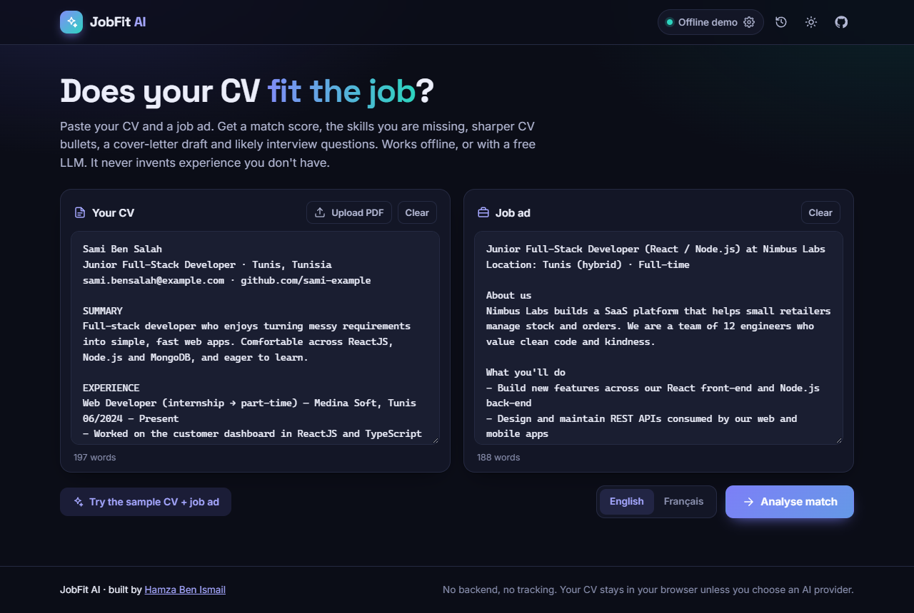
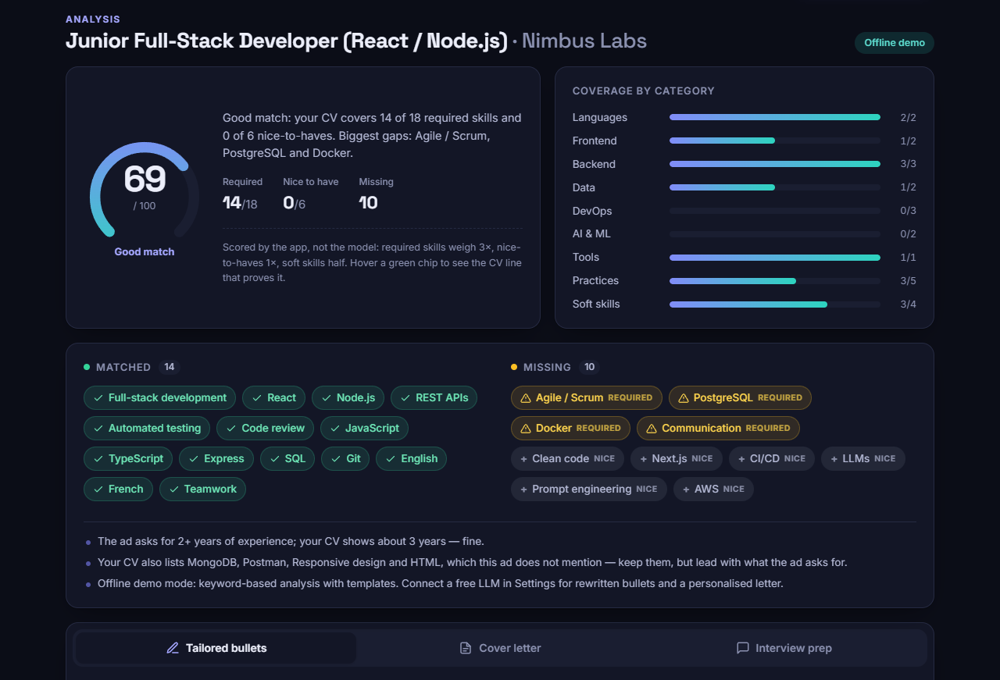
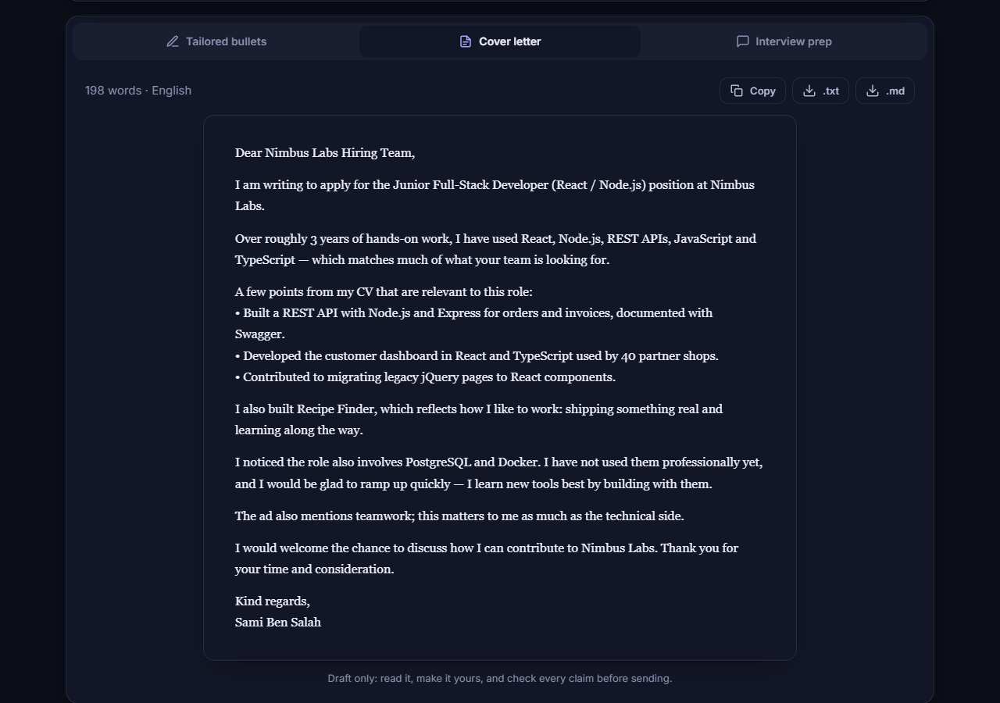
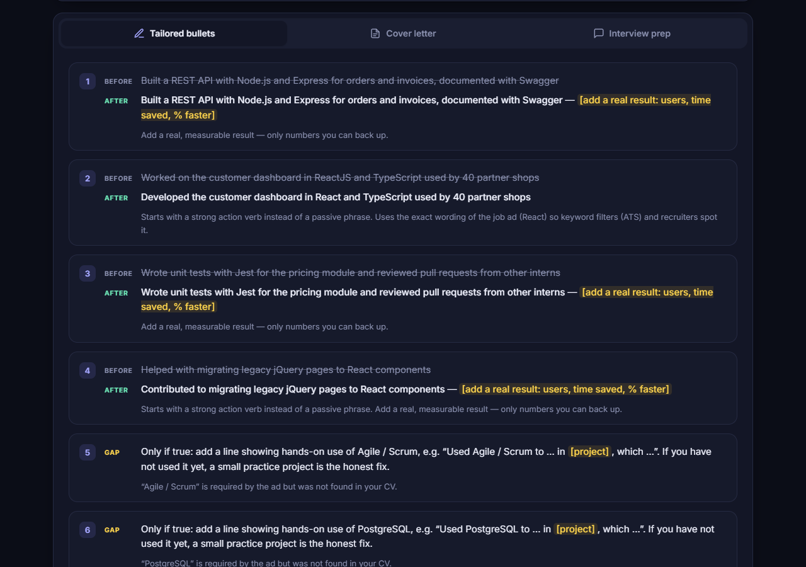
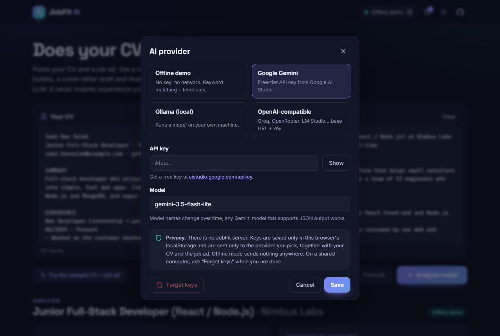
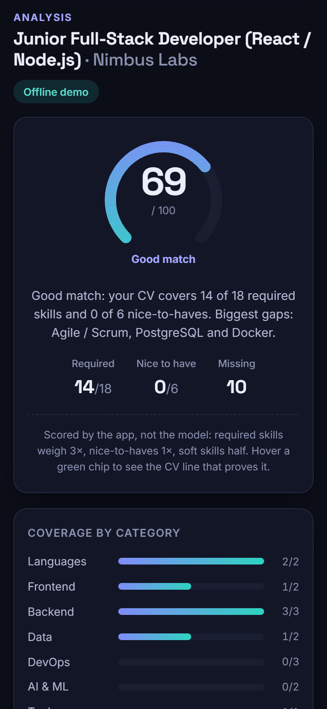
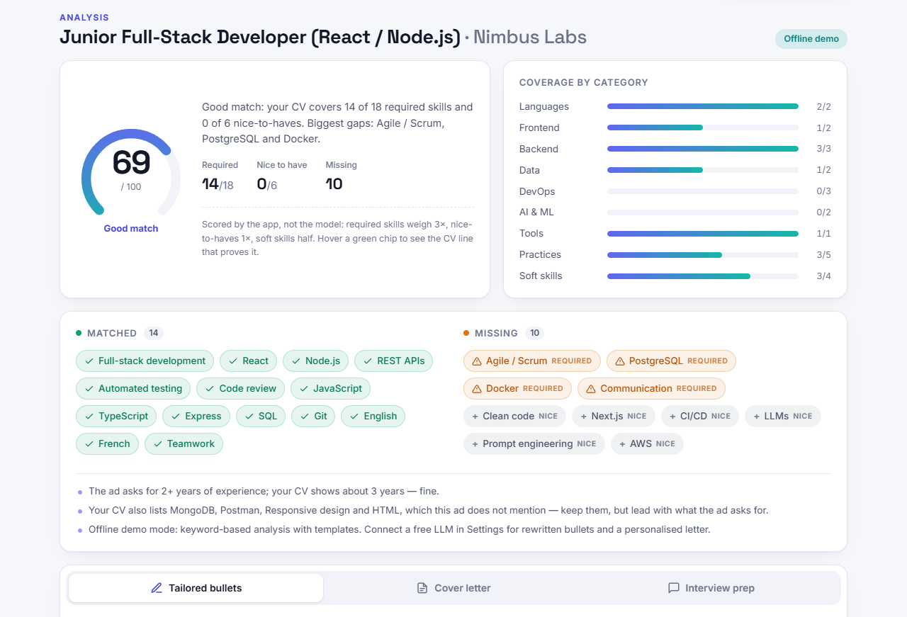

# JobFit AI

**Paste your CV and a job ad. Get a match score, the skills you're missing, sharper CV bullets, a cover-letter draft (English or French) and likely interview questions. It never invents experience you don't have.**

[](https://github.com/naniiic137/jobfit-ai/actions/workflows/ci.yml)

**Live demo:** https://naniiic137.github.io/jobfit-ai/
<sub>(The link works once GitHub Pages is enabled for this repository: *Settings → Pages → Source: GitHub Actions*.)</sub>

It runs entirely in the browser. There is no backend and nothing to pay for:

- **Offline demo mode** (default): works with no API key and no network. Keyword analysis against a curated skills taxonomy, plus templates.
- **Google Gemini**: bring a free-tier API key from Google AI Studio.
- **Ollama**: a model running on your own machine.
- **Any OpenAI-compatible API**: for example Groq's free tier, OpenRouter or LM Studio.



## Screenshots

| Results: score, coverage, matched and missing skills | Cover-letter draft (copy, or download as .txt / .md) |
| --- | --- |
|  |  |
| **Tailored CV bullets (before / after, placeholders for real numbers)** | **Provider settings and privacy note** |
|  |  |

<p align="center">
  
  &nbsp;&nbsp;
  
</p>

All screenshots use the bundled sample CV and job ad in offline mode. The candidate "Sami Ben Salah" and the company "Nimbus Labs" are made up.

## Features

- **CV input:** paste it, or upload a PDF. Text is extracted in the browser with pdf.js, which is lazy-loaded so it is only downloaded when you need it.
- **Match score from 0 to 100** with a breakdown by category (languages, frontend, backend, data, DevOps, AI, tools, practices, soft skills).
- **Matched and missing skill chips.** Missing skills are marked *required* or *nice to have*, based on the section of the ad they appear in. Hover a matched chip to see the CV line that proves it.
- **Tailored CV bullets** shown as before/after. Weak verbs get replaced, the ad's wording is reused (for example "ReactJS" becomes "React"), and a highlighted placeholder asks for a *real* metric.
- **Cover-letter draft** in English or French: copy it, or download it as `.txt` or `.md`.
- **Likely interview questions**, each with why it may be asked and a tip that points back to your own CV.
- **History** of past analyses, kept in localStorage (last 20).
- **Sample CV and job ad** so you can try it in one click.
- Dark and light themes, responsive down to 390px, keyboard-accessible tabs and dialogs, and a skip link.

## How it works

```
                      ┌──────────────────────────────┐
  CV (paste / PDF) ──►│                              │
                      │   runAnalysis(settings, …)   │
  Job ad ────────────►│                              │
                      └──────────────┬───────────────┘
                                     │
          ┌──────────────────────────┴───────────────────────────┐
          │ provider = offline                                   │ provider = gemini | ollama | openai
          ▼                                                      ▼
┌──────────────────────────┐              ┌──────────────────────────────────────────────┐
│ Offline analyzer         │              │ prompts/  system rules + 1 few-shot example  │
│ • taxonomy (107 skills,  │   pre-scan   │           + <cv>/<job_ad> fenced input       │
│   EN + FR synonyms)      │─────hint────►│ providers/ gemini · ollama · openaiCompat    │
│ • section detection      │              │           (raw text out, JSON requested)     │
│   (required / nice /     │              │ run.ts    extractJson → zod.safeParse        │
│   responsibilities /     │              │           invalid? → 1 repair call with the  │
│   perks)                 │              │           validation errors → zod again      │
│ • templates (EN / FR)    │              └──────────────────────┬───────────────────────┘
└────────────┬─────────────┘                                     │
             │           AnalysisPayload (the same zod schema)   │
             └──────────────────────────┬────────────────────────┘
                                        ▼
                 ┌──────────────────────────────────────────────┐
                 │ finalize()                                   │
                 │ • dedupe skills                              │
                 │ • verify every "in CV" claim against the CV  │
                 │   (evidence quote or taxonomy)               │
                 │ • compute score + breakdown (app-side)       │
                 └──────────────────────┬───────────────────────┘
                                        ▼
                         React UI  ·  localStorage history
```

**Every provider returns the same `AnalysisPayload`** (`src/schemas/analysis.ts`). The offline analyzer builds it deterministically, and LLM providers are asked to return it as JSON. Either way it goes through the same `finalize()` step.

**The score is computed by the app, not by the model.** Each skill the job ad asks for is labelled `required` or `nice`. Required skills weigh 3, nice-to-haves 1, and soft skills count half because a CV can't really prove them. The score is the weighted share you cover. The same formula is used for every provider, so an LLM can't hand out a "92" that contradicts its own skill list.

### Offline analyzer (no key needed)

1. **Extraction.** `src/analyzer/taxonomy.ts` holds 107 hand-picked skills with aliases (`ReactJS`, `Postgres`, `K8s`…) and French synonyms (`travail en équipe`, `tests unitaires`, `intégration continue`, `apprentissage automatique`…). Matching ignores accents and case, handles tokens like `C++`, `C#`, `.NET`, `Node.js` and `CI/CD`, and doesn't confuse `Java` with `JavaScript`. Ambiguous words (`Go`, `Rust`, `Express`, `Swift`) are only accepted with their capital letter and in a list-like context.
2. **Section detection.** `src/analyzer/sections.ts` splits the ad into *intro / requirements / nice-to-have / responsibilities / company / perks* using English and French headings ("Profil recherché", "Atouts", "Vos missions"…). Inline markers such as "is a plus" or "serait un plus" downgrade a single line. Skills that only appear under perks ("AWS training budget") are ignored.
3. **Implied skills.** MySQL on a CV satisfies an ad that asks for SQL, and NestJS implies Node.js, TypeScript and JavaScript. The evidence shown is the more specific skill's line.
4. **Templates.** Bullet rewrites, gap advice, cover letter and interview questions come from EN/FR templates (`src/analyzer/templates.ts`). They only use **direct quotes from the CV** or **clearly marked placeholders**.

## Prompt-engineering approach

The prompts live in `src/prompts/`:

| File | What it does |
| --- | --- |
| `system.ts` | System instructions. **Grounding rules come first**, then the output spec, then language and format rules. |
| `fewshot.ts` | One compact worked example (CV, ad and the full JSON answer). A unit test validates it against the zod schema, so it can't drift from what the app accepts. |
| `build.ts` | Builds the messages (`system` + few-shot pair + real request), fences the untrusted input, and builds the repair prompt. |

**The grounding rule (the most important one):**

> Never invent experience, employers, dates, numbers, degrees, certificates or skills that the CV does not contain.

In practice this means:

- A skill can only be `inCv: true` with an **`evidence` quote copied verbatim from the CV**. After the response comes back, `finalize()` checks each quote against the CV text, ignoring case, quotes and whitespace and allowing `…` cuts. A claim that can't be verified is shown as *unverified* and **earns no points**.
- Rewritten bullets may rephrase and reorder, but must keep the facts. Missing metrics become placeholders like `[add real number of users]`, never invented numbers.
- The cover letter may only claim what the CV supports. For missing skills it expresses willingness to learn.

**Structured output, validated and repaired:**

1. The request asks for JSON: Gemini gets `responseMimeType: application/json` plus a `responseJsonSchema` generated from the zod schema (`z.toJSONSchema`), Ollama gets the schema through `format`, and OpenAI-compatible APIs get `response_format: { type: "json_object" }`.
2. The reply goes through `extractJson`, which tolerates markdown fences and surrounding prose, and then `AnalysisPayloadSchema.safeParse`.
3. If validation fails, **one repair call** is made. It replays the bad answer with the exact zod errors (`skills.0.importance: Invalid option…`) and asks for a corrected object. If that fails too, the user sees a clear error instead of half-broken data.

**Other prompt details:**

- **Prompt-injection guard.** The CV and the ad are wrapped in `<cv>` / `<job_ad>` tags, closing tags inside them are neutralised, and the system prompt says their content is data, not instructions.
- **Pre-scan hint.** The deterministic keyword scan is passed along as a hint labelled "may be incomplete or wrong — verify against the texts". This helps small local models not to miss obvious skills.
- **Context limits.** Inputs are clipped to 12,000 characters each so requests stay within free-tier limits.

## Privacy

- **There is no JobFit server.** The app is static files on GitHub Pages.
- **Offline mode sends nothing anywhere.** Your CV and the ad stay in your browser.
- With an AI provider, the CV and the ad are sent **only to the provider you pick** (Google, your local Ollama, or the base URL you enter).
- **API keys are stored only in this browser's `localStorage`** and are sent only to that provider. Gemini keys go in the `x-goog-api-key` header, never in the URL. Settings has a **Forget keys** button, which is worth using on a shared computer.
- History and drafts are also kept in `localStorage` and can be cleared from the History dialog.
- Calling an LLM API directly from the browser means the key sits in the browser. That is fine for a personal key on your own machine, but don't paste a key you share with others.

## Run locally

Requirements: Node.js 20+ (CI uses Node 22).

```bash
git clone https://github.com/naniiic137/jobfit-ai.git
cd jobfit-ai
npm install
npm run dev        # http://localhost:5182/jobfit-ai/
```

Click **Try the sample CV + job ad**, then **Analyse match**.

### Using a free LLM (optional)

- **Gemini:** create a key at <https://aistudio.google.com/apikey>, then open the provider pill in the top bar and choose *Google Gemini*. The default model is `gemini-3.5-flash-lite`. Model names change often, so the field is editable (suggestions: `gemini-3.8-flash`, `gemini-flash-latest`, `gemini-2.5-flash`).
- **Ollama:** `ollama pull llama3.2`. Browsers can only call Ollama if it allows your origin, so start it with `OLLAMA_ORIGINS`:
  ```bash
  # macOS / Linux
  OLLAMA_ORIGINS="https://naniiic137.github.io,http://localhost:5182" ollama serve
  # Windows (PowerShell)
  $env:OLLAMA_ORIGINS="https://naniiic137.github.io,http://localhost:5182"; ollama serve
  ```
- **OpenAI-compatible (for example Groq):** base URL `https://api.groq.com/openai/v1`, your key, and a model such as `llama-3.3-70b-versatile`.

## Tests

```bash
npm test           # Vitest: 97 tests in 9 files
npm run build      # tsc --noEmit (strict) + vite build
```

What the tests cover:

- **Extraction** (`extract.test.ts`): special-character tokens, Java vs JavaScript, aliases, French synonyms, ambiguous words, evidence snippets.
- **Section detection** (`sections.test.ts`): English and French headings, key/value lines, inline "is a plus" markers, ignored perks, strongest importance wins.
- **Scoring** (`score.test.ts`): weights, bands, category breakdown.
- **Facts** (`facts.test.ts`): years of experience from explicit text or date ranges (education excluded), job title and company, CV name, bullets and projects.
- **Offline analyzer** (`offline.test.ts`): end-to-end on the sample. The output passes the LLM schema, every evidence quote exists in the CV, the cover letter never claims missing skills, metrics are placeholders, and French output and French ads work.
- **Grounding checks** (`finalize.test.ts`): invented evidence is flagged and earns no points.
- **zod schemas** (`analysis.test.ts`): the few-shot example is valid, bad shapes are rejected, and the JSON Schema export is checked.
- **Prompt builders** (`prompts.test.ts`): grounding rule, language, fencing and injection guard, clipping, repair prompt.
- **Provider pipeline** (`run.test.ts`): JSON extraction, validate → repair → give up, offline mode makes no network call, and the Gemini request shape (key in a header, roles mapped, JSON mode on), with `fetch` mocked.

## Project structure

```
src/
├── analyzer/          # deterministic engine (offline mode + scoring for all modes)
│   ├── taxonomy.ts    # 107 skills, aliases, French synonyms, implications
│   ├── extract.ts     # accent-insensitive token matching, evidence snippets
│   ├── sections.ts    # required / nice-to-have / responsibilities / perks detection
│   ├── facts.ts       # name, bullets, projects, years; job title, company, min years
│   ├── score.ts       # weighted score, category breakdown, bands
│   ├── templates.ts   # EN/FR strings, weak-verb table, interview question bank
│   ├── offline.ts     # analyzeOffline(): builds the AnalysisPayload
│   └── finalize.ts    # dedupe, evidence verification, score → AnalysisResult
├── prompts/           # system.ts · fewshot.ts · build.ts (messages, fencing, repair)
├── providers/         # gemini.ts · ollama.ts · openaiCompat.ts · http.ts · run.ts (validate + repair)
├── schemas/           # analysis.ts: zod schema + JSON Schema export
├── components/        # Results, ScoreGauge, SettingsDialog, HistoryDialog, Dialog, Icons
├── lib/               # pdf.ts (pdf.js), storage.ts (localStorage), download.ts
├── data/samples.ts    # fictional sample CV + job ad
├── App.tsx · main.tsx · styles.css
.github/workflows/     # ci.yml (test + build) · deploy.yml (GitHub Pages)
docs/screenshots/
```

## Tech stack

React 18 · TypeScript (strict) · Vite · zod · pdf.js (`pdfjs-dist`) · Vitest · plain CSS with design tokens (dark and light themes) · GitHub Actions and GitHub Pages.
LLM providers: Google Gemini (Generative Language REST API), Ollama, and any OpenAI-compatible Chat Completions API.

## Limitations

- Offline mode is keyword-based. It only knows the skills in the taxonomy, and its cover letter is a template built from your own CV lines. A connected LLM writes more natural text.
- The Gemini, Ollama and OpenAI-compatible paths are covered by mocked tests, but real responses depend on the model you choose. Small local models may need the repair step more often.
- PDF import reads text-based PDFs. Scanned (image-only) CVs need to be pasted as text.

## Author

Built by **Hamza Ben Ismail** ([@naniiic137](https://github.com/naniiic137)), a junior full-stack developer based in Tunisia.

## License

Not chosen yet.
